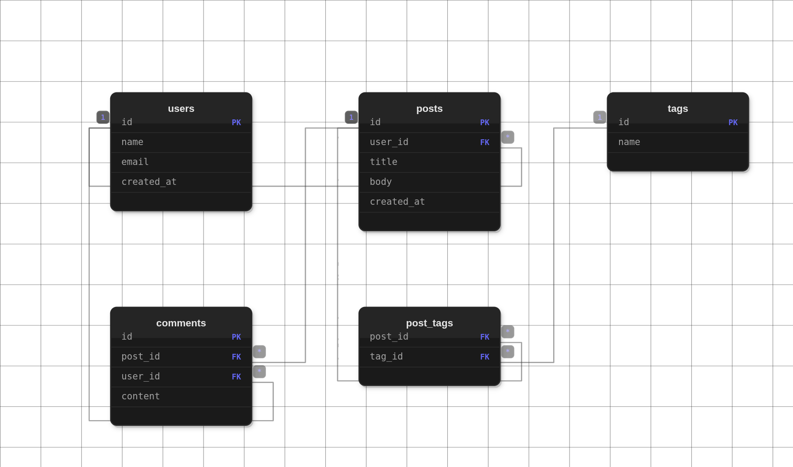

# dbdiagramr

> Stop drawing your database by hand.

Paste your PostgreSQL connection string. Get a beautiful, interactive ER diagram in seconds.



## Features

- **Instant** — Connects to your PostgreSQL database and generates a diagram in under 10 seconds
- **Interactive** — Pan, zoom, and hover over tables to trace relationships
- **Secure** — Your connection string is never stored. We introspect your schema and discard everything else.
- **Self-hostable** — Open source. Run it yourself or use our hosted version.

## Quick Start

### Hosted (Easiest)

Visit [dbdiagramr.space](https://dbdiagramr.space) and paste your connection string.

### Self-hosted

```bash
git clone https://github.com/VarunKvK/dbdiagramr
cd dbdiagramr
npm install
npm run dev
```

Then open [http://localhost:3000](http://localhost:3000) and try it with your database.

## Tech Stack

- **Next.js 14** + TypeScript
- **Tailwind CSS** for styling
- **PostgreSQL** (via `pg`) for schema introspection
- **SVG** diagram rendering — no Canvas, no proprietary dependencies

## License

MIT - see [LICENSE](LICENSE).

## Contributing

Issues and PRs welcome. This is a solo indie project built in public.
